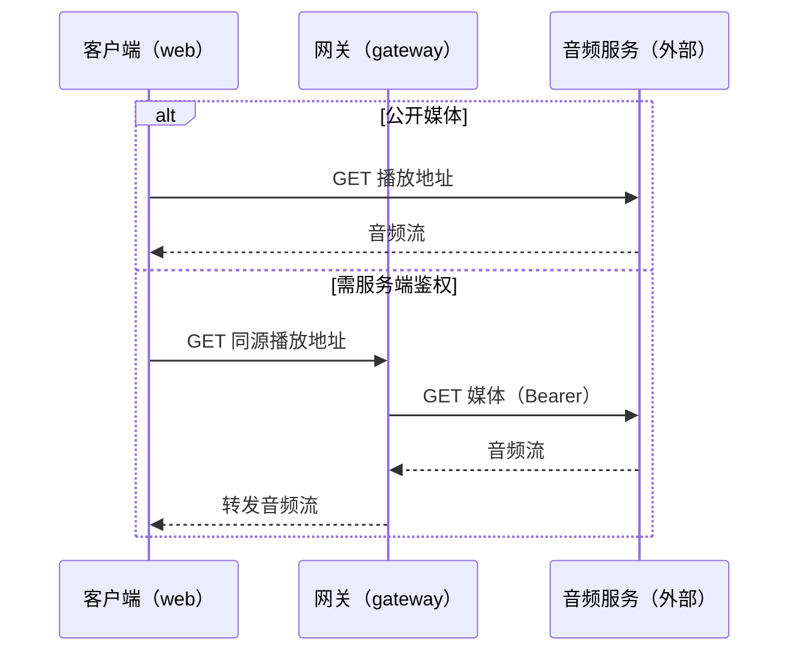

# 用例：PR 中的设计原图与红框标注

## 模式

编写模式

## 输入

一次改动让已有媒体时序图增加需要服务端鉴权的播放路径。设计文档中更新后的图为：

代码实现了这两个分支。PR 中还有其他未变更的模块图。审阅者要求 PR 简介展示受影响的设计图，并以红框标出变化。

## 合格结果

- 核对设计图差异，只展示确实改动的时序图，不把未变更的模块图列作改动；
- 从对应提交的 Mermaid 原图渲染，仅在新增鉴权分支上叠加红框，不修改源文档中的图；
- 保留三个参与者、两种路径及每条请求/响应；标题链接到对应版本的设计图；
- 交付前确认 PR 展示与最新源图、实际实现一致，后续提交修改源图时同步更新展示。

## 失败特征

- 将时序图改画成 `flowchart` 的“客户端 → 网关 → 音频服务”，丢掉公开路径及返回消息，却称为原图；
- 用红框圈出重画的新流程而非原图中的实际改动；
- 源设计改动后仍引用旧图片，或展示未变更的模块图作为本次改动。

## 边界条件

用户没有要求展示或标注设计图时，不强制生成图片；没有现存源图时，不声称新绘的示意图与原图一致。

## 反馈依据

审阅者要求 PR 图与最新设计图完全一致、只用红框标出变化；将时序图重画成流程图后，PR 简介缺失了原有时序信息。
