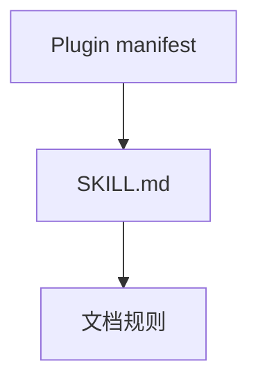
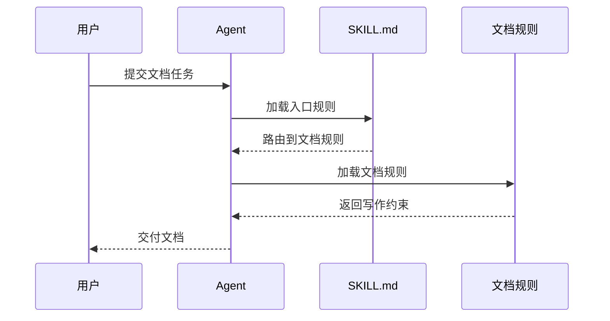
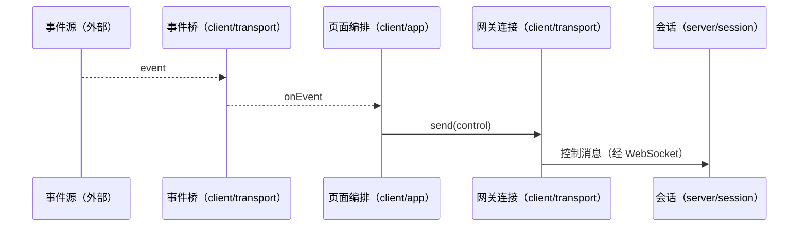
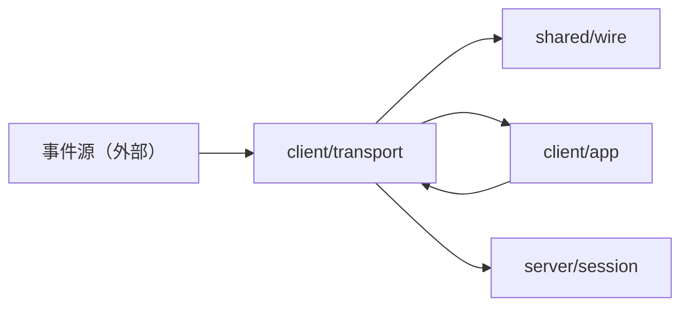
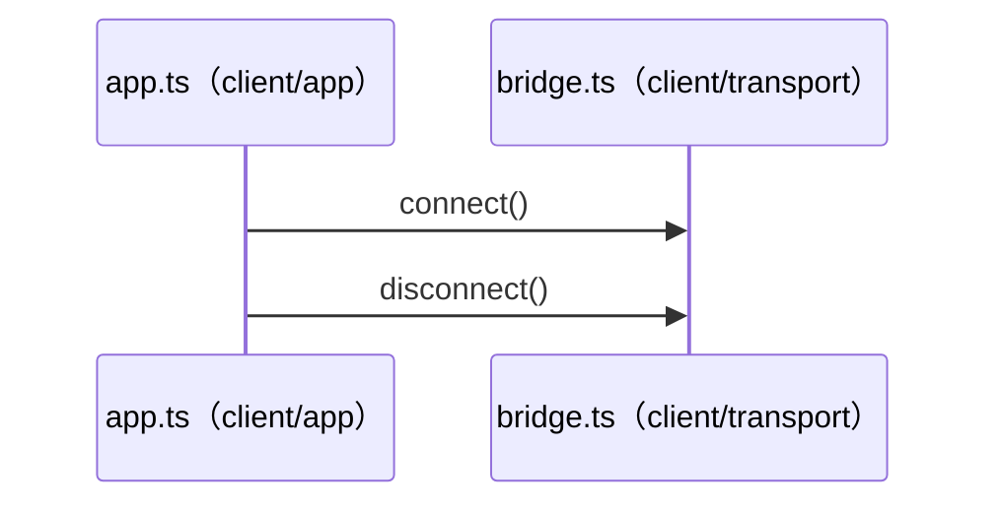
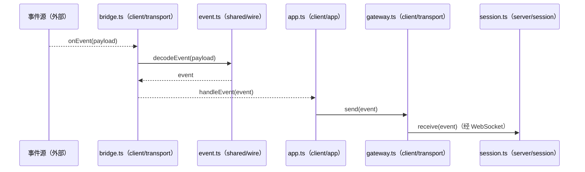

## 技术文档正反例

### 简单问题

任务：`2 * 3` 等于几？

错误：

> 在通常的十进制数学环境中，如果不考虑其他代数结构，2 与 3 相乘的结果为 6。

正确：

> 6。

### 配置说明

任务：把客户端请求超时设为 5 秒。

错误：

> 超时参数在现代分布式系统中非常重要。设置前请检查权限、网络环境和系统版本，并在修改后执行额外命令确认文件已经保存。

```yaml
client:
  timeout_seconds: 5
```

正确：

```yaml
client:
  timeout_seconds: 5
```

如果系统存在会改变该配置含义的真实版本限制，再补充该限制；不要预先罗列未知边界。

### 架构文档中的图表

任务：说明插件仓库的文件结构、组件依赖，以及 Agent 加载规则的核心顺序。

错误：

```text
Plugin manifest
  -> SKILL.md
    -> 文档规则
```

再用一段文字描述 Agent、Skill 和规则文件之间的调用顺序。读者需要从字符缩进和文字中自行还原关系。

正确：

文件层级保留文本树：

```text
skills/
└── engineering-agent/
    ├── SKILL.md
    └── references/
        └── docs/
            └── rules.md
```

组件依赖使用 Mermaid 组件图：



多参与者的核心调用顺序使用 Mermaid 时序图：



### 多模块设计的覆盖与阅读路径

任务：一个项目有客户端、服务端和共享协议。读者要求从 README 逐层看懂模块与主要类型，以及外部事件如何到达服务端；目前整体设计只有组件图，本地设计只有文件列表。

错误：

> 总设计反复概括每个目录，本地设计只列出 `bridge.ts`、`app.ts` 和 `session.ts` 的文件名；图中有一条“外部事件 → 服务端”箭头，却没有说明事件从何处进入客户端、谁负责转发，以及连接失败时发生什么。

正确：

> README 链到整体设计；整体设计交代客户端、服务端与共享协议的关系，并链接到拥有流程的模块设计。客户端传输模块说明事件桥接收外部事件、交给页面编排，并写清断线重连和无效事件的处理；服务端会话模块说明收到控制消息后的状态变化。各模块链接主要类型和实现文件，不在整体设计中重复局部流程。

只有少量文件且读者可以连续读完的项目，不必为每个目录创建独立文档；按真实机制的复杂度决定细节，不按代码行数分配篇幅。

### 时序图中的参与者归属

任务：事件由外部源进入客户端传输模块，经过页面编排到服务端会话；读者看不出原图中的 `Client`、`App` 和 `Session` 分别属于哪里。

错误：只给参与者写抽象类名，再让读者到正文猜测它们属于哪个模块或外部系统。

正确：



若参与者在当前页面已经唯一且清楚，不必给每列重复写完整源码路径；失败和重连机制放在拥有它的模块设计中，不靠这张图猜。

### 用户要求图示全覆盖

任务：实际模块为 `client/app`、`client/transport`、`server/session`、`shared/wire`。运行时文件及目标方法为 `app.ts:handleEvent`、`bridge.ts:connect/onEvent/disconnect`、`gateway.ts:send`、`session.ts:receive`、`event.ts:decodeEvent`；另有 `styles.css`、`types.ts`、`session.test.ts`。要求模块图覆盖所有模块，时序图覆盖所有运行时文件及公开或跨模块复用的方法。

错误：只画 `app → session` 的主路径，漏掉 `shared/wire`、`gateway.ts` 和 `disconnect()`；为凑文件数量把样式或测试画成运行时参与者。

正确：模块关系图列出四个模块，按启动/结束与事件交接拆成两张时序图；非运行时文件由模块图或文件职责索引说明。







覆盖索引：`bridge.ts` 对应启停和事件图；`app.ts`、`gateway.ts`、`session.ts`、`event.ts` 对应事件图；`styles.css`、`types.ts`、`session.test.ts` 对应文件职责索引。若公开方法还未被调用，另画标明“未接入”的契约时序图，不要编造真实调用。未要求全覆盖时，原本简单的流程不必扩成这组图。
