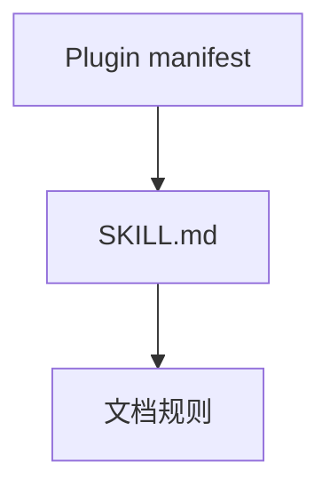
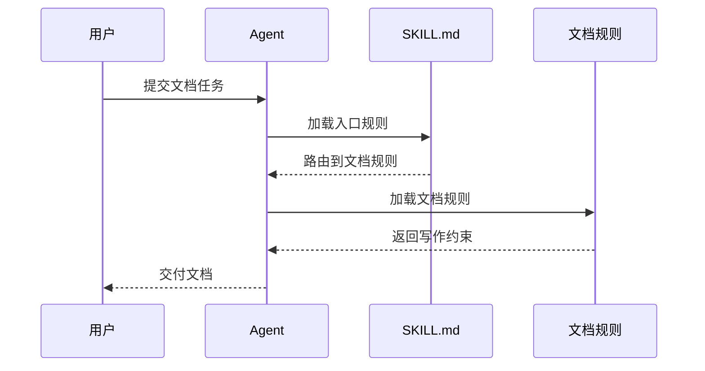

## 技术文档正反例

### 简单问题

任务：`2 * 3` 等于几？

错误：

> 在通常的十进制数学环境中，如果不考虑其他代数结构，2 与 3 相乘的结果为 6。

正确：

> 6。

### 配置说明

任务：把客户端请求超时设为 5 秒。

错误：

> 超时参数在现代分布式系统中非常重要。设置前请检查权限、网络环境和系统版本，并在修改后执行额外命令确认文件已经保存。

```yaml
client:
  timeout_seconds: 5
```

正确：

```yaml
client:
  timeout_seconds: 5
```

如果系统存在会改变该配置含义的真实版本限制，再补充该限制；不要预先罗列未知边界。

### 架构文档中的图表

任务：说明插件仓库的文件结构、组件依赖，以及 Agent 加载规则的核心顺序。

错误：

```text
Plugin manifest
  -> SKILL.md
    -> 文档规则
```

再用一段文字描述 Agent、Skill 和规则文件之间的调用顺序。读者需要从字符缩进和文字中自行还原关系。

正确：

文件层级保留文本树：

```text
skills/
└── engineering-agent/
    ├── SKILL.md
    └── references/
        └── docs/
            └── rules.md
```

组件依赖使用 Mermaid 组件图：



多参与者的核心调用顺序使用 Mermaid 时序图：


